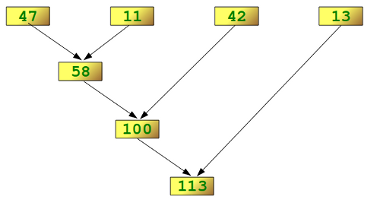

___

<a href='https://www.udemy.com/user/joseportilla/'></a>
___
<center><em>Content Copyright by Pierian Data</em></center>

# reduce()

Many times students have difficulty understanding reduce() so pay careful attention to this lecture. The function reduce(function, sequence) continually applies the function to the sequence. It then returns a single value. 

If seq = [ s1, s2, s3, ... , sn ], calling reduce(function, sequence) works like this:

* At first the first two elements of seq will be applied to function, i.e. func(s1,s2) 
* The list on which reduce() works looks now like this: [ function(s1, s2), s3, ... , sn ]
* In the next step the function will be applied on the previous result and the third element of the list, i.e. function(function(s1, s2),s3)
* The list looks like this now: [ function(function(s1, s2),s3), ... , sn ]
* It continues like this until just one element is left and return this element as the result of reduce()

Let's see an example:


```python
from functools import reduce

lst =[47,11,42,13]
reduce(lambda x,y: x+y,lst)
```


    113


Lets look at a diagram to get a better understanding of what is going on here:


```python
from IPython.display import Image
Image('http://www.python-course.eu/images/reduce_diagram.png')
```


    

    


Note how we keep reducing the sequence until a single final value is obtained. Lets see another example:


```python
#Find the maximum of a sequence (This already exists as max())
max_find = lambda a,b: a if (a > b) else b
```


```python
#Find max
reduce(max_find,lst)
```


    47


Hopefully you can see how useful reduce can be in various situations. Keep it in mind as you think about your code projects!
